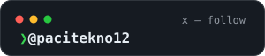
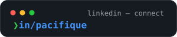
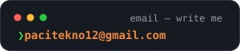

<!-- pac-cee/pac-cee — profile README, rendered as a terminal session.
     metrics.terminal.svg is regenerated daily by .github/workflows/metrics.yml -->

```console
pac@github:~ $ whoami
Pacifique — I love building.
```

```console
pac@github:~ $ ssh pac-cee@github.com
Connected. Stats below are generated daily from real activity — no third-party servers.
```




<p>
  <a href="https://x.com/pacitekno12"></a>
  <a href="https://www.linkedin.com/in/pacifique-a113663a6/"></a>
  <a href="mailto:pacitekno12@gmail.com"></a>
</p>

```console
pac@github:~ $ exit
logout — gone building.
```
